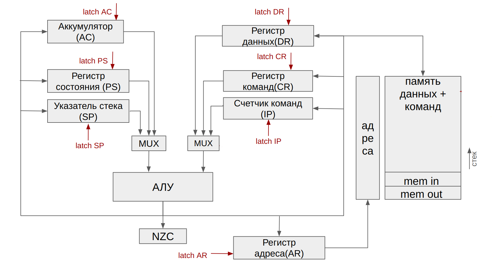
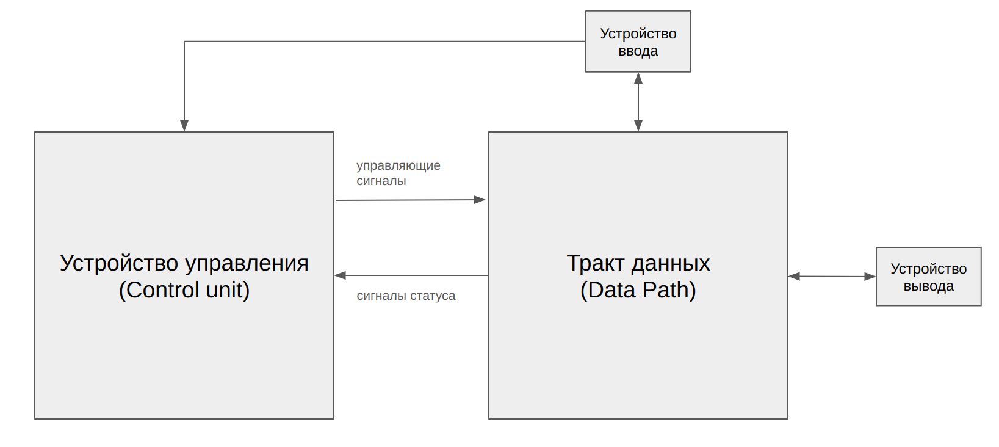

# AmAsm. Транслятор и модель

- P3214, Мухамеджанов Артур Илдусович.
- `asm | acc | neum | hw | instr | binary| trap | mem | pstr | prob1 `
- Без усложнения

## Язык программирования

### Синтаксис

**Форма Бэкуса-Наура:**

```ebnf
<программа> ::= <строка_программы> | <строка_программы> <программа>
<строка_программы> ::= <адрес> | [<метка>] <адресная команда> <операнд> | 
[<метка>] <безадресная команда> | [<метка>] <метка константы> <константа> | <пустая строка> 

<метка> ::= <слово>
<адресная команда> = add | load | store | ... | sub | jmp | (см. систему команд)
<безадресная команда> ::= cla | di | ei | ... | hlt
<операнд> ::= <число> | <метка>
<константа> ::= <число> | <число> '<слово>'
<слово> ::= <символ> | <слово> <символ>
<число> ::= <цифра> | <число> <цифра>
<цифра> ::= 0| 1 | 2 | .. | 8 | 9
<символ> ::= a | b | c | ... | z | A | B | C | ... | Z | <цифра>
```

**Пояснение:**

Каждая непустая строка программы это одно из нижеперечисленных:

* **адресная команда**
    * может иметь метку в начале
    * указывается название команды и адрес операнда через пробел
* **безадресная команда**
    * может иметь метку в начале
    * указывается только название команды
* **константа**
    * может иметь метку в начале
    * указывается метка константы `word:` и константа
    * константа может быть 16-битным знаковым числом
    * константа может быть строкой: указывается длина строки и строка через пробел
* **адрес**
    * указывается специальное слово `org` и адрес в десятичном формате

Пример программы, вычисляющей С = A + B

```asm
org 5
A: word: 10
B: word: 15
C: word: 0

start: cla
load A
add B
store C
hlt
```

**Семантика**

- Видимость данных -- глобальная
- Поддерживаются целочисленные литералы, находящиеся в диапазоне от $`-2^{31}`$ до $`2^{31}-1`$
- Поддерживаются строковые литералы, символы стоки необходимо заключить в кавычки, перед строкой через запятую необходимо указать длину
- Код выполняется последовательно

- Программа обязательно должна включать метку `start:`, указывающую на 1-ю выполняемую интсрукцию. Эта метка не может
  указывать на константу.
- Название метки не должно совпадать с названием команды и не может начинаться с цифры.
- Метки находятся на одной строке с командами, операнды находятся на одной строке с командами.
- Пустые строки игнорируются, количество пробелов в начале и конце строки не важно.
- Любой текст, расположенный в конце строки после символа `';'` трактуется как комментарий.

Память выделяется статически, при запуске модели.

## Организация памяти

* Память команд и данныx --- общая
* Размер машинного слова --- `32` бит
* Память содержит `2^11` ячеек
* Ячейка с адресом `0` зарезервирована под вектор прерывания устройства ввода
* Адрес `2045` является указателем стека при старте процессора. Стек растет вверх.
* Ячейка с адресом `2046` маппится на устройство ввода
* Ячейка с адресом `2047` маппится на устройство вывода


* Поддерживаются следующие **виды адресаций**:
    * **Прямая**: в качестве аргумента команды передается адрес ячейки, значение в которой будет использовано как
      операнд.
      Например, если `mem[30] = 25`, то команда `add 30` обозначает, что к значению в аккумуляторе добавится число 25.

    * **Косвенная**: в качестве аргумента команды передается адрес, по которому лежит адрес операнда.
      Например, если `mem[30] = 25`, `mem[33] = 30`, то команда `add (33)` также обозначает, что к аккумулятору
      добавится значение 25.


* Существует несколько **регистров**:
    * Аккумулятор (AC): в него записываются результаты всех операций
    * Счетчик команд (IP): хранит адрес следующей выполняемой команды
    * Указатель стека (SP): при вызове прерывания текущее состояние счетчика команд сохраняется на стеке
    * Регистр состояния (PS): хранит маркер того, что наступило прерывание

      ```
        | ie/id | ir | N | Z | C |
         4        3    2   1   0
      ```
        * 0-й бит хранит значение флага C
        * 1-й бит хранит значение флага Z
        * 2-й бит хранит значение флага N
        * 3-й бит содержит 1, если поступил запрос прерывания, и 0 иначе
        * 4-й бит содержит 1, если прерывания разрешены (interrupts enabled) и 0, если запрещены (interrupts disabled)


* Регистр данных (DR): хранит данные для записи в память и считывания из памяти
* Регистр адреса (AR): хранит адрес последней ячейки в памяти, к которой было обращение

## Система команд

Особенности процессора:

- Машинное слово -- `32` бита, знаковое.
- В качестве аргументов команды принимают `11` битные беззнаковые адреса

Каждая команда выполняется в несколько циклов:

1. Цикл выборки команды: по адресу из счетчика команд из памяти достается команда

- `IP -> AR, IP + 1 -> IP, mem[AR] -> DR, DR -> CR`

2. Цикл выборки операнда (для адресных команд): в регистр данных помещается адрес операнда, регистр данных передавется в
   регистр адреса, из памяти в регистр данных записывается значение операнда

- `CR[addr] -> DR, DR -> AR, mem[AR] -> DR`

3. Цикл исполнения: совершаются действия, необходимые для выполнения команды. Результаты вычисления записываются в
   аккумулятор
4. Цикл прерывания: проверяется, не произошел ли запрос на прерывание

### Набор инструкций

| Язык  | Адресная | Ветвление | Описание                                                                                       |
|:------|:---------|-----------|:-----------------------------------------------------------------------------------------------|
| load  | +        | -         |  загрузить значение из заданной ячейки                                                          |
| store | +        | -         |  загрузить значение в заданную ячейку                           
| add   | +        | -         |  добавить значение из заданной ячейки к аккумулятору                     
| sub   | +        | -         |  вычесть значение из заданной ячейки из аккумулятора                     
| mod   | +        | -         |  получить остаток от деления аккумулятора на значение из ячейки                           
| jmp   | +        | +         |  перейти в заданную ячейку                           
| cmp   | +        | -         |  выставить флаги как результат вычитания заданной ячейки из аккумулятора, сохранить аккумулят
| jmn   | +        | +         |  перейти в заданную ячейку если N = 1                                
| jmnn  | +        | +         |  перейти в заданную ячейку если N = 0                                
| jmc   | +        | +         |  перейти в заданную ячейку если C = 1                                
| jmnc  | +        | +         |  перейти в заданную ячейку если C = 0                                
| jmz   | +        | +         |  перейти в заданную ячейку если Z = 1                                
| jmnz  | +        | +         |  перейти в заданную ячейку если Z = 0                                
| asl   | -        | -         |  сдвинуть значение в аккумуляторе влево, AC[15] -> C                                
| asr   | -        | -         |  сдвинуть значение в аккумуляторе вправо, AC[0] -> C                                
| dec   | -        | -         |  уменьшить значение в аккумуляторе на 1                                
| inc   | -        | -         |  увеличить значение в аккумуляторе на 1                                
| cla   | -        | -         |  очистить аккумулятор (записать в него 0)                               
| hlt   | -        | -         |  остановить работу программы                        |
| iret  | -        | -         |  возрат из прерывания                               |
| push  | -        | -         |  положить значение из аккумулятора на стек                             
| pop   | -        | -         |  достать значение с вершины стека и записать в аккумулятор                      
| di    | -        | -         |  запретить прерывания                               |
| ei    | -        | -         |  разрешить прерывания                               |
| nop   | -        | -         |  отсутствие операции                                                                            |

Коды команда:
00000 - add
00001 - load 
00010 - store
00011 - cmp  
00100 - mod  
00101 - jmp  
00110 - jmn  
00111 - jmnn 
01000 - jmz  
01001 - jmnz
01010 - jmc
01011 - jmnc
01100 - hlt
01101 - cla
01110 - iret
01111 - asl
10000 - asr
10001 - inc
10010 - dec
10011 - push
10100 - pop
10101 - di
10110 - ei
10111 - nop

## Бинарные файлы
### Состав фалйа
- Первые 4 байта - индекс старта
- Последующие байты: 4 байта - индекс инструкции, 4 байта - инструкция
### Кодирование инструкций
Каждая инструкция/адреса инструкций кодируются 32 битами.
Значения битов инструкций: 
- 32 - команда или данные(если 0 (данные) то все остальное - данные)
- 31 - Если команда - адресная(1) или безадресная(0), Если данные - число(0) или символ(1)
- 30 - Если адресная: косвенная или относительная адресация
- 29 - 25 - код команды
- 24 - 14 - адрес ячейки операнда
- 13 - 0 - нули, если команда


Пример содержимого файла .debug:

```
4 - 00000000000000000000011111111110 - value: 2046
5 - 00000000000000000000011111111111 - value: 2047
10 - 10010110000000000000000000000000 - mnemonic: ei
11 - 11000001000000000110000000000000 - mnemonic: load operand: 3
12 - 11001000000000010110000000000000 - mnemonic: jmz operand: 11
```


## Транслятор

Интерфейс командной строки: `translator.py <input_file> <target_file>`

Реализовано в модуле: [translator](./src/translator.py)

Этапы трансляции (функция `translate`):

1. Выделение меток из кода, проверка их корректности (не совпадают с названиями команд, отсуствуют дубликаты)
2. Парсинг кода построчно, определение типа команды (адресная, безадресная, константа)
3. Генерация машинного кода в зависимости от типа команды

Правила генерации машинного кода:

- Метки не сохраняются в машинном коде. Метки, использованные в качестве операнда, преобразуются к адресам команд

## Модель процессора

Интерфейс командной строки: `mashine.py <machine_code_file> <input_file>`

Реализовано в модуле: [mashine](./src/machine.py).

### DataPath

Реализован в классе `DataPath`.



`data_memory` -- однопортовая память, поэтому либо читаем, либо пишем.
`registers`
Сигналы (реализованы в виде методов класса):
В

- `set_reg` -- защёлкнуть выбранное значение в регистре с указанным именем
- `rd` --- считать данные из `mem[AR]` в регистр `DR`
- `wr` --- записать данные из регистра `DR` в `mem[AR]`

В виде отдельного класса реализовано арифметико-логическое устройство (АЛУ)

- в данном классе реализован метод `calc`, принимающий аргументы с одного или двух входов и совершающий над ними
  арифметико-логическую операцию
- в результате выполнения операций устанавливаются следующие флаги
    - `Z` -- значение в аккумуляторе равно 0
    - `N` -- значение в аккумуляторе отрицательно
    - `C` -- произошло переполнение (перенос из 16-го бита)

### ControlUnit

Реализован в классе `ControlUnit`.



- Метод `decode_and_execute_instruction` моделирует выполнение полного цикла инструкции (цикл выборки инструкции,
  операнда, исполнения)
- После завершения цикла исполнения проверяется, не произошел ли запрос прерывания, и разрешены ли прерывания. Если оба
  условия верны, то вызывается метод `process_interrupt`
- В рамках реализованной модели на python существуют счетчик количества инструкций только для наложения ограничения на
  кол-во шагов моделирования

Особенности работы модели:

- Цикл симуляции осуществляется в функции `simulation`.
- Шаг моделирования соответствует одному такту процессора с выводом состояния в журнал.
- Для журнала состояний процессора используется стандартный модуль `logging`.
- Остановка моделирования осуществляется при:
    - превышении лимита количества выполняемых инструкций;
    - исключении `Incorrect unary operation` или `Incorrect binary operation`-- если в ALU поданны некорректные бинврные или унарные операции
    - если выполнена инструкция `hlt`.

- обработка прерываний осуществляется в методе `process_interrupt`
    - на стек сохраняются текущие значения счетчика команд (IP), и регистра состояния (PS)
    - в IP записывается адрес из вектора прерываний (хранится в ячейке 0)
    - выполняются все команды для обработки прерывания. При выполнении команды  `iret` происходит возврат в основную
      программу
    - из стека достаются значения IP и PS и присваиваются соответствующим регистрам

Проверка наличия запроса прерывания осуществляется после завершения цикла выполнения очередной команды.

- Вложенные прерывания возможны, программист должен управлять запретом и разрешением прерываний самостоятельно при
  помощи команд:
    - ei (enable interrupt) --- разрешить прерывания
    - di (disable interrupt) --- запретить прерывания
- Все регистры кроме PS и IP программист должен самостоятельно сохранять на стек в методе-обработчике прерываний.

## Тестирование

Реализованные програмы

1. [hello world](./programms_examples/asmcode/hello.amasm): вывести на экран строку `'Hello World!'`
2. [cat](./programms_examples/asmcode/cat.amasm): программа `cat`, повторяем ввод на выводе.
3. [hello_username](./programms_examples/asmcode/hello_username.amasm) -- программа `hello_username`: запросить у пользователя его
   имя, считать его, вывести на экран приветствие
4. [prob1](./programms_examples/asmcode/prob1.amasm): найти сумму чисел до 1000, которые деляться на 3 или на 5.

Интеграционные тесты реализованы тут [integration_test](./src/integration_test.py):

- через golden tests, конфигурация которых лежит в папке [golden](./src/golden/)

CI:

``` yaml
name: Run Integration Tests

on:
  push:
    branches:
      - main
  pull_request:
    branches:
      - main

jobs:
  test:
    runs-on: ubuntu-latest

    steps:
    - name: Checkout repository
      uses: actions/checkout@v2

    - name: Set up Python
      uses: actions/setup-python@v2
      with:
        python-version: 3.11

    - name: Install dependencies
      run: |
        python -m pip install --upgrade pip
        pip install pytest
        pip install pytest-golden

    - name: Run integration tests
      run: pytest src/integration_test.py 
    - name: Run prob test
      run: pytest src/prob_test.py
```


Выводится листинг всех регистров.

- Значения всех регистров, кроме PS и CR выводятся в десятичном формате
- Значение регистра `PS` выводится в двоичном формате для удобного определения флагов, наличия запроса прерываний и тд.
- В качестве значения регистра `CR`выводятся код оператора и операнд (при наличии)
- Если в какой-то регистр записан символ, в листинге выводится его код

Также в лог выводятся события вида `INPUT symbol` и `OUTPUT symbol`